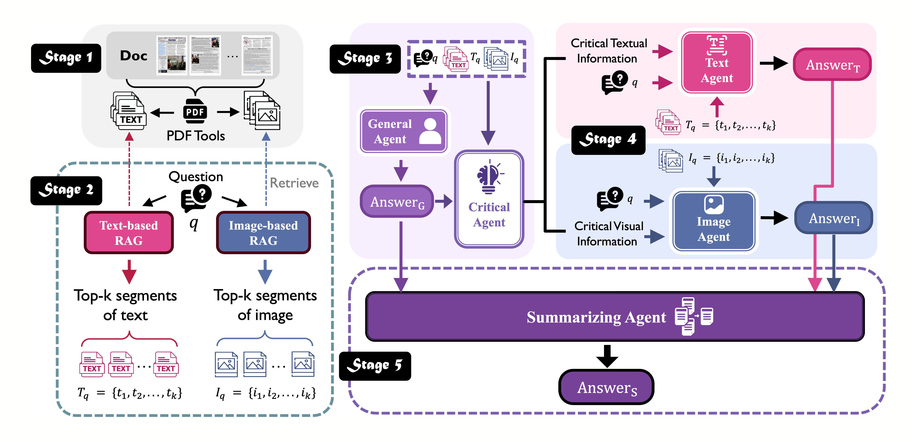

# MDocAgent

## Overview

We propose MDocAgent, a novel multi-modal multi-agent framework for document question answering. It integrates text and image retrieval through five specialized agents — general, critical, text, image, and summarizing agents — enabling collaborative reasoning across modalities. Experiments on five benchmarks show a 12.1% improvement over state-of-the-art methods, demonstrating its effectiveness in handling complex real-world documents.



## Requirements

1. Clone this repository and navigate to MDocAgent folder

```bash
git clone https://github.com/aiming-lab/MDocAgent.git
cd MDocAgent
```

2. Install Package: Create conda environment

```bash
conda create -n mdocagent python=3.12
conda activate mdocagent
bash install.sh
```

3. Data Preparation

- Create a data directory:
    ```bash
    mkdir data
    cd data
    ```
- Download the dataset from [huggingface](https://huggingface.co/datasets/Lillianwei/Mdocagent-dataset) and place it in the `data` directory. The documents of PaperText are same as PaperTab. You can use symbol link or make a copy.

- Return to the project root:
    ```bash
    cd ../
    ```

- Extract the data using:
    ```bash
    python scripts/extract.py --config-name <dataset>  # (choose from mmlb / ldu / ptab / ptext / feta)
    ```
The extracted texts and images will be saved in `tmp/<dataset>`.

## Retrieval

- **Text Retrieval**

    Set the retrieval type to `text` in `config/base.yaml`:
    ```yaml
    defaults:
    - retrieval: text
    ```
    Then run:
    ```bash
    python scripts/retrieve.py --config-name <dataset>
    ```

- **Image Retrieval**

    Switch the retrieval type to `image` in `config/base.yaml`:
    ```yaml
    defaults:
    - retrieval: image
    ```
    Run the retrieval process again:
    ```bash
    python scripts/retrieve.py --config-name <dataset>
    ```

The retrieval results will be stored in:
```
data/<dataset>/sample-with-retrieval-results.json
```

## Multi-Agent Inference

Run the following command:
```bash
python scripts/predict.py --config-name <dataset> run-name=<RUN_NAME>
```
> **Note:** `<RUN_NAME>` can be any string to uniquely identify this run (required).

The inference results will be saved to:  
```
results/<dataset>/<run-name>/<run-time>.json
```

To specify the top-4 retrieval candidates, use:
```bash
python scripts/predict.py --config-name <dataset> run-name=<RUN_NAME> top_k=4
```

## Evaluation

1. Add your OpenAI API key in `config/model/openai.yaml`.

2. Run the evaluation (make sure `<RUN_NAME>` matches your inference run):
    ```bash
    python scripts/eval.py --config-name <dataset> run-name=<RUN_NAME>
    ```
The evaluation results will be saved in:
```
results/<dataset>/<run-name>/results.txt
```
> **Note:** Evaluation will use the newest inference result file with same `<RUN_NAME>`.

## Citation

```bibtex
@article{han2025mdocagent,
  title={MDocAgent: A Multi-Modal Multi-Agent Framework for Document Understanding},
  author={Han, Siwei and Xia, Peng and Zhang, Ruiyi and Sun, Tong and Li, Yun and Zhu, Hongtu and Yao, Huaxiu},
  journal={arXiv preprint arXiv:2503.13964},
  year={2025}
}
```

---
